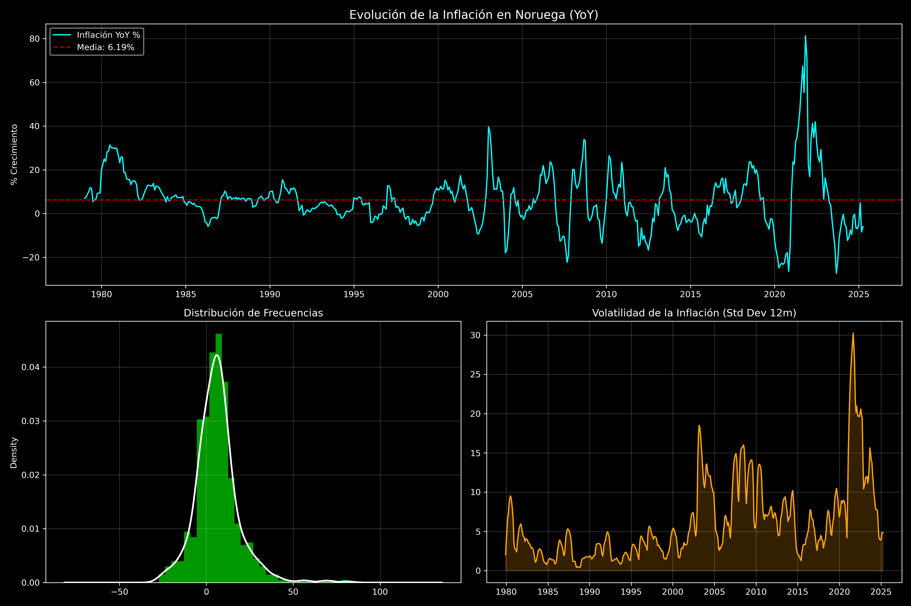

# Reporte de Análisis Descriptivo: Inflación Noruega

Este documento resume los hallazgos del análisis estadístico realizado sobre la serie de inflación de Noruega (YoY) basada en el archivo `CPGREN01NOM659N.csv`.

## 1. Métricas Estadísticas Clave

| Métrica | Valor | Interpretación |
| :--- | :--- | :--- |
| **Media Histórica** | 6.19% | Nivel promedio de largo plazo. |
| **Volatilidad (Std Dev)** | 12.46% | Indica una dispersión extrema y choques frecuentes. |
| **Persistencia (ACF Lag-1)** | 0.9154 | La inflación de hoy explica fuertemente la de mañana. |
| **Sesgo (Skewness)** | 1.19 | Asimetría positiva: predominan los shocks al alza. |
| **Curtosis** | 5.32 | Alta probabilidad de eventos extremos ("Colas pesadas"). |

## 2. Visualización del Problema

*Figura 1: Panel de evolución, distribución y volatilidad móvil de la inflación.*

## 3. Observaciones Econométricas

### La Anomalía de la Persistencia
La persistencia de **0.91** es el factor determinante para el modelo MS-DSGE. En un entorno de **Expectativas Racionales (m=1)**, este nivel de inercia requeriría una respuesta de política monetaria extremadamente agresiva para cumplir con el Taylor Principle. 

### El Rol de la Sparsity (m < 1)
Bajo la teoría de **Sparsity de Gabaix**, el hecho de que los agentes sean "miopes" ($m = 0.85$) permite que el Norges Bank mantenga la estabilidad incluso con esta volatilidad estructural. Los ciudadanos no internalizan completamente la persistencia de los shocks, lo que reduce la presión sobre el Banco Central para sobre-reaccionar.

### Conclusión sobre el Régimen
La distribución (Curtosis > 3) justifica plenamente el uso de un modelo de **Markov Switching**. La inflación no se mueve suavemente, sino que salta entre regímenes de alta y baja volatilidad, lo cual es capturado por el motor de identificación implementado en `main.py`.
