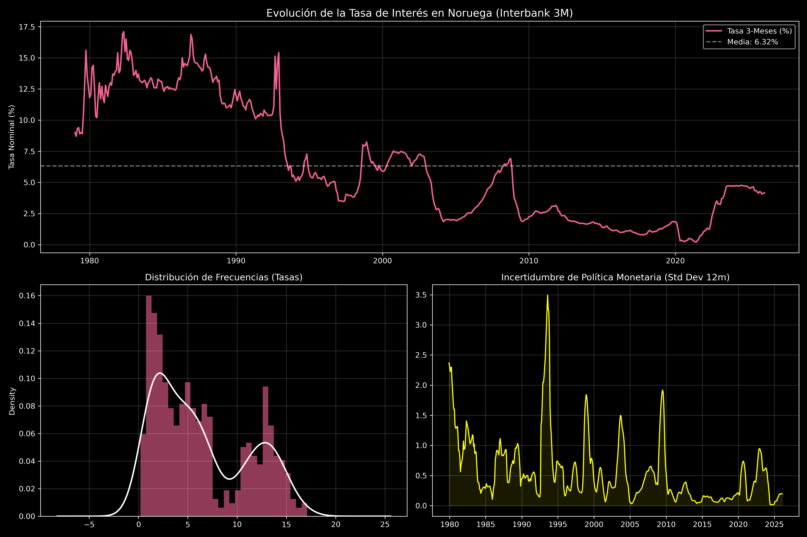

# Reporte de Análisis Descriptivo: Tasa de Interés Noruega

Este documento resume los hallazgos del análisis estadístico de la tasa de interés interbancaria a 3 meses en Noruega, basado en el archivo `IR3TIB01NOM156N.csv`.

## 1. Métricas Estadísticas Clave

| Métrica | Valor | Interpretación |
| :--- | :--- | :--- |
| **Media Histórica** | 6.32% | El costo promedio del dinero en el periodo. |
| **Mínimo Detectado** | 0.20% | **Riesgo de ZLB:** Proximidad extrema al límite cero. |
| **Máximo Histórico** | 17.10% | Refleja periodos de crisis o alta inflación pasada. |
| **Persistencia (rho)** | 0.9929 | **Inercia Extrema:** La política monetaria es muy gradual. |
| **Curtosis** | -1.03 | Distribución platicúrtica: Menos shocks extremos que en la inflación. |

## 2. Visualización del Problema

*Figura 1: Evolución histórica, distribución y volatilidad de la tasa interbancaria.*

## 3. Observaciones Econométricas

### La Inercia de la Política Monetaria
La persistencia de **0.99** es sustancialmente mayor que la de la inflación (0.91). Esto indica que el Norges Bank practica un fuerte **"Interest Rate Smoothing"**. Los cambios en las tasas no son abruptos, sino que se mueven en tendencias muy marcadas. 

### El Dilema del Zero Lower Bound (ZLB)
Con un mínimo de **0.20%**, Noruega ha rozado el límite donde la política monetaria convencional pierde efectividad. En el modelo MS-DSGE, esto implica que en el **Régimen Paloma**, el Banco Central podría estar "atrapado" si ocurre un choque negativo, ya que no tiene margen para bajar más las tasas.

### Conexión con Sparsity y Gabaix
Bajo **Sparsity (m=0.85)**, la altísima persistencia de la tasa de interés es menos "dolorosa" para la economía de lo que predice la teoría convencional. Dado que los agentes descuentan el futuro de forma cognitiva, el anuncio de que las tasas se mantendrán bajas por mucho tiempo (Forward Guidance) tiene un impacto menor, lo que obliga al Banco Central a ser más persistente en sus acciones reales que en sus anuncios.

### Conclusión sobre la Estructura
La baja curtosis sugiere que la tasa de interés es una variable "gestionada" y menos errática que la inflación. El "problema" para tu tesis no es la volatilidad de la tasa en sí, sino su **proximidad al cero** y su **extrema lentitud** para reaccionar ante los shocks de inflación analizados previamente.
