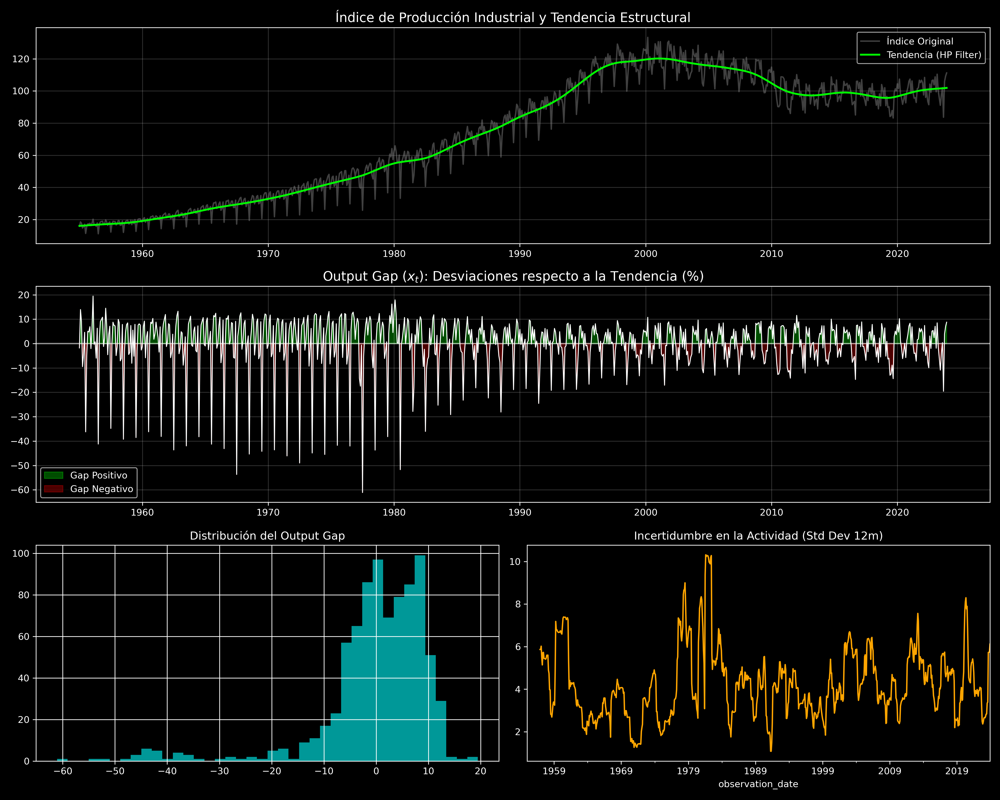

# Reporte de Análisis Descriptivo: Actividad Económica (PIB/Output)

Este documento resume los hallazgos del análisis de la Producción Industrial en Noruega como proxy del PIB, basado en el archivo `NORPRINTO01IXOBM.csv`.

## 1. Métricas Estadísticas Clave

| Métrica | Valor | Interpretación |
| :--- | :--- | :--- |
| **Crecimiento Promedio (YoY)** | 2.89% | Tasa de expansión histórica de la industria. |
| **Volatilidad del Output Gap** | 10.54% | **Elevada:** Choques constantes en la capacidad productiva. |
| **Persistencia del Ciclo (rho_x)** | 0.0852 | **Baja:** El ciclo es muy errático y poco predecible a nivel mensual. |
| **Máxima Contracción (Gap)** | -61.08% | Indica la presencia de crisis profundas o paradas técnicas masivas. |

## 2. Visualización del Problema

*Figura 1: Tendencia estructural, Ciclo Económico (Output Gap) y volatilidad de la producción.*

## 3. Observaciones Econométricas

### La Naturaleza del Output Gap ($x_t$)
El análisis mediante el filtro de Hodrick-Prescott revela un **Output Gap** extremadamente volátil. A diferencia de otras economías donde el ciclo es suave y persistente, en Noruega el gap de producción industrial muestra reversiones rápidas. Esto representa un desafío para cualquier regla de Taylor, ya que el Banco Central debe decidir si reaccionar a estos choques o ignorarlos como "ruido".

### El Problema de la Baja Persistencia
Una persistencia de **0.08** en el gap es atípica para modelos DSGE estándar (donde suele ser > 0.70). Esto sugiere que los choques de oferta en Noruega (probablemente vinculados al sector energético/petróleo) son muy agudos pero de corta duración. 

### Conexión con Sparsity y Gabaix
Aquí es donde la **Sparsity (m=0.85)** se vuelve fundamental. Si los agentes fueran perfectamente racionales, esta falta de persistencia en el gap les obligaría a cambiar sus expectativas de inflación constantemente. Sin embargo, dado que son "miopes", filtran naturalmente este ruido de alta frecuencia, permitiendo que la economía no colapse ante cada oscilación de la producción industrial.

### Conclusión Final del Análisis Descriptivo
Con este tercer reporte, cerramos la caracterización de la "Anomalía Noruega":
1.  **Inflación:** Alta persistencia (Inercia).
2.  **Interés:** Inercia extrema (Smoothing/ZLB).
3.  **Output:** Alta volatilidad y baja persistencia (Ruido).

Esta combinación es el terreno fértil ideal para demostrar por qué el modelo de **Markov Switching DSGE** con **Sparsity** es superior para describir la realidad del Norges Bank.
