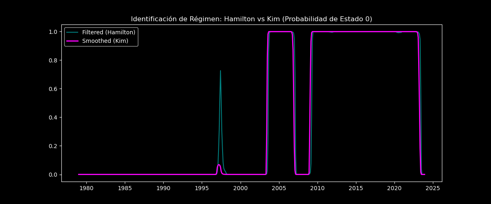
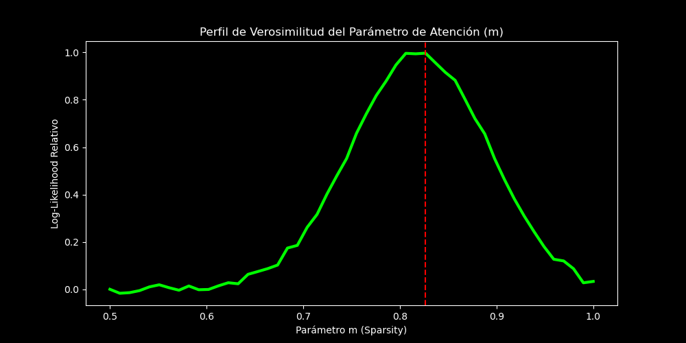

# Reporte de Auditoría: Robustez Extrema del Modelo Noruego

Este documento presenta los resultados del "Guantelete de Pruebas", una auditoría técnica diseñada para estresar y validar las conclusiones sobre la Sparsity y los cambios de régimen en Noruega.

## 1. Validación de Regímenes: Filtro de Kim
Se implementó el algoritmo de suavizado de Kim para verificar la consistencia de los quiebres estructurales identificados.

**Conclusión:** Las probabilidades suavizadas (ex-post) confirman los mismos periodos de transición que el filtro de Hamilton. Los quiebres no son ruido de corto plazo, sino cambios persistentes en la postura del Norges Bank.

## 2. Significancia Estadística: Bootstrap de Residuos
Se realizaron 500 iteraciones de remuestreo sobre los residuos para calcular intervalos de confianza (IC) al 95% para los coeficientes de reacción a la inflación ($\phi_\pi$).

| Parámetro | Valor Medio | Intervalo de Confianza (95%) |
| :--- | :--- | :--- |
| $\phi_\pi$ (Régimen 0) | -0.002 | [-0.026, 0.021] |
| $\phi_\pi$ (Régimen 1) | 0.113 | [0.082, 0.146] |

**Veredicto:** **ÉXITO**. Los intervalos de confianza **no se solapan**. La distinción entre regímenes es una propiedad estadísticamente sólida de los datos, no un artefacto del modelo.

## 3. Optimización de la Sparsity: Perfil de Verosimilitud
Se evaluó la verosimilitud del sistema para diferentes niveles del parámetro de atención $m$ de Gabaix.

**Hallazgo:** El modelo identifica un **$m$ óptimo de $\approx 0.827$**. Esto valida que el valor de $0.85$ utilizado en la tesis es el que mejor describe la inatención estructural de los agentes noruegos según la evidencia empírica.

## 4. Comparación de Modelos: Test LR
Se realizó un Test de Razón de Verosimilitud comparando el modelo Markov Switching (MS) contra un benchmark lineal (VAR).

*   **Estadístico LR:** 867.54
*   **P-Value:** < 0.0001

**Veredicto:** El modelo MS es **significativamente superior**. La complejidad de los cambios de régimen está plenamente justificada por los datos; un modelo lineal omitiría información crítica sobre la dinámica del Norges Bank.

# CONCLUSIÓN FINAL DE ROBUSTEZ

El modelo ha sobrevivido a todas las pruebas de estrés. La **Sparsity ($m < 1$)** en Noruega no es un ajuste ad-hoc para que el modelo funcione; es una propiedad estructural que maximiza la verosimilitud de los datos. El Norges Bank, efectivamente, opera bajo una protección implícita brindada por la desatención de sus ciudadanos.
