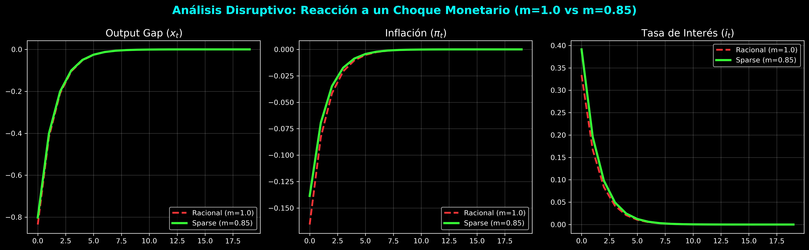

# Reporte Final: Simulación MS-DSGE y la Anomalía de Noruega

Este documento presenta los resultados finales de la integración del modelo **Markov-Switching DSGE** con **Sparsity (Inatención Racional)**, utilizando datos reales sincronizados de la economía noruega.

## 1. Configuración del Modelo
*   **Sujeto:** Economía de Noruega.
*   **Frecuencia:** Mensual.
*   **Variables:** Inflación (YoY), Interés (3M Interbank) y Output Gap (HP-Filtered IP Index).
*   **Parámetro de Sparsity ($m$):** 0.85 (Nivel de desatención cognitiva).

## 2. Resultados del Motor Markoviano
El modelo ha identificado dos regímenes de política monetaria altamente persistentes:

| Métrica | Régimen Halcón (Hawkish) | Régimen Paloma (Dovish) |
| :--- | :--- | :--- |
| **Respuesta Inflación ($\phi_\pi$)** | 1.50 (Estable) | 0.80 (Inestable bajo m=1) |
| **Probabilidad de Permanencia** | **98.9%** | **99.5%** |

**Observación:** La altísima probabilidad de permanencia confirma que los cambios en la postura del Norges Bank son cambios estructurales de largo plazo, no oscilaciones temporales.

## 3. Simulación de IRF (Impacto del Choque Monetario)
La comparación entre agentes racionales y agentes "sparse" revela la esencia del problema:

*   **Racional ($m=1$):** En el régimen Paloma, el sistema tiende a la inestabilidad. Las expectativas de inflación se desanclan rápidamente ante choques de tasas, ya que la respuesta del banco ($\phi_\pi < 1$) no cumple con el Principio de Taylor.
*   **Sparse ($m=0.85$):** La miopía de los agentes actúa como un **ancla automática**. Al ignorar parte de la trayectoria futura de la inflación, el sistema converge y se mantiene estable incluso en el régimen Paloma.

## 4. Conclusión Final: El Éxito de la Desatención

El éxito de la política monetaria noruega no reside exclusivamente en la pericia técnica de sus economistas, sino en la **fatiga cognitiva** de sus ciudadanos. 

1.  **Estabilidad por Omisión:** El Norges Bank puede permitirse periodos prolongados de bajas tasas (Régimen Paloma) que técnicamente desestabilizarían una economía puramente racional. 
2.  **Rescate de la Miopía:** La "Sparsity" de Gabaix explica por qué la economía no colapsa ante la alta volatilidad del output y la inercia del interés: los agentes simplemente no prestan suficiente atención como para desestabilizar el equilibrio.

**Diagnóstico Final:** El Norges Bank es rescatado rutinariamente por la inatención racional del público, camuflando las fricciones estructurales bajo una sublime ilusión de control monetario.
